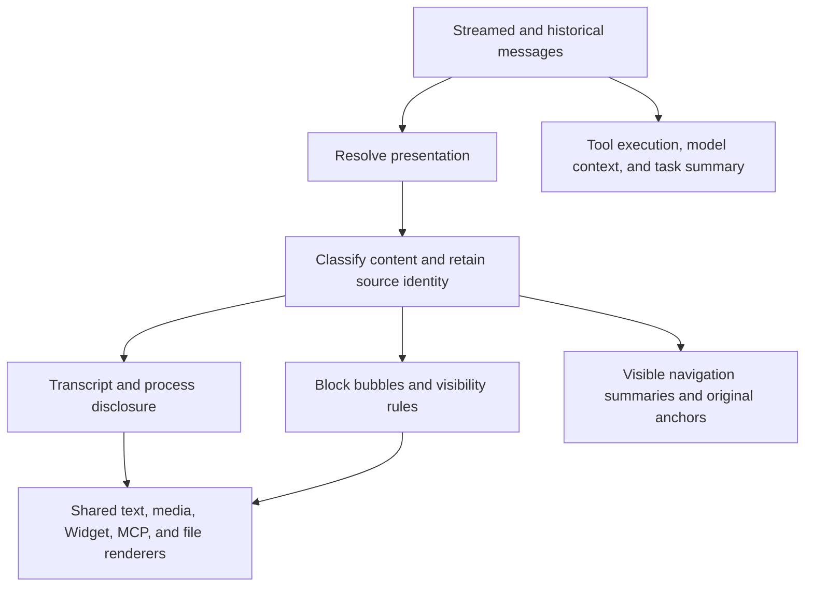

# Message Bubble Rendering Architecture

Bubble presentation is a projection of existing messages, not a new message protocol. See [Message bubble presentation](./message-bubble-presentation.md) for configuration, published Assistant defaults, user behavior, and acceptance records.

## Configuration resolution

`resolveMessagePresentation` applies explicit host options, then Assistant defaults, then the UI fallback. Mode and process collapse are resolved independently: specifying `collapseProcess` does not suppress an Assistant's mode, and explicit `false` is not treated as absent. Collapse is active only in transcript mode.

| Resolved configuration                  | Result                                                                           |
| --------------------------------------- | -------------------------------------------------------------------------------- |
| No host or Assistant mode               | Transcript                                                                       |
| Transcript with `collapseProcess: true` | Existing process disclosure                                                      |
| Bubbles                                 | Text/result bubbles; ordinary process UI hidden                                  |
| Bubbles with `collapseProcess: true`    | Bubble rules apply; the stored collapse setting takes effect when switching back |

The public interface does not add independent `hideTools` or `hideReasoning` switches. A single visibility policy keeps required approvals and questions from disappearing through incompatible flag combinations.

## Rendering pipeline



Both modes share one keyed component tree. Mounting two lists and hiding one with CSS would duplicate forms, iframes, timers, and side effects. Switching modes must not destroy stateful interaction instances.

Paths below are relative to `packages/chatkit-ui/src/`:

| Module                                                                         | Responsibility                                                                                            |
| ------------------------------------------------------------------------------ | --------------------------------------------------------------------------------------------------------- |
| `lib/message-presentation.ts`                                                  | Precedence, classification, source descriptors, actor identity, visible reply text, and completion status |
| `components/thread/messages/assistant-content.tsx`                             | Shared content tree, stable keys, and process/result visibility                                           |
| `components/thread/messages/assistant-blocks.tsx`                              | Shared leaf renderers extracted from `ai.tsx`                                                             |
| `components/thread/messages/ai.tsx`                                            | Reply status and trailing result components                                                               |
| `components/thread/messages/bubble-tool-results.tsx`                           | Explicitly supported visible tool results                                                                 |
| `components/thread/messages/component-message-renderers.tsx`                   | Dedicated result renderers and `hasBubbleResult` classification                                           |
| `components/thread/messages/message-bubble.tsx` and root `message-bubbles.css` | Container appearance and responsive sizing                                                                |
| `components/thread/MessageList.tsx`                                            | Original-message actions, approvals, references, and actor adaptation                                     |

`buildMessagePresentation` is a pure projection. It does not execute tools, request data, or create React nodes. Registry grouping such as `standalone`/`grouped-step` is distinct from visibility: a grouped interaction may still need to remain visible.

## Content boundaries

One nonempty original text block becomes one text bubble. Markdown paragraphs, punctuation, newlines, and SSE chunks do not split it. Hiding a tool between two text blocks does not merge the blocks. Received content is not delayed to satisfy an animation sequence.

```text
Original assistant message:
  text#1: "I will inspect this first."
  tool#2: internal observation
  text#3: "Here is the result."
  resource-card#4

Visible bubbles:
  [I will inspect this first.]
  [Here is the result.]
  [File result card]
  Original-message actions / timestamp
```

Ordinary tools, reasoning, memory, and typed internal events retain their data while hiding their process chrome. Tool artifacts, including screenshots, are not automatically treated as user-facing images. Only explicitly supported result renderers with `hasBubbleResult` escape hidden tool chrome. Normal message images and resource cards retain their existing rendering and resource semantics.

Widgets, MCP Apps, approvals, questions, and confirmed answers retain their call IDs, callbacks, and local state. Historical MCP components do not reconnect or invoke tools. Unknown components keep the controlled compatibility renderer rather than being silently discarded by name.

Child Agents and external Assistants keep attribution and their existing execution entry points. Their visible text is not flattened into the main Assistant's voice. Their internal tools use the same visibility rules.

## Identity and streaming

A logical message may have several bubbles but still has one original `messageId`. Each presentation unit records `messageId`, optional `blockId`, original `sourceIndex`, and optional `executionId`. Stable keys prefer the original content ID and fall back to the unfiltered source position. Never use filtered bubble indexes or random render-time IDs.

The positional fallback preserves identity only while source order is stable. It cannot guarantee lossless matching after arbitrary reordering of legacy ID-less blocks. Resource cards and file receipts retain their existing stable keys and deduplication.

Appending tokens updates the same bubble. Empty blocks occupy no space. Streaming, pause, failure, and completion come from actual run state, not from bubble presence. A text-free reply shows its results or a status; absent completion evidence does not imply success. A recovered intermediate tool failure does not turn an otherwise successful reply into a failed reply.

Mode changes use the original message anchor and relative offset to retain reading position. Users already following the bottom remain at the bottom; users reading earlier history are not pulled down. Image loads, code expansion, and MCP frame resizing follow the existing viewport lifecycle.

## Actions and accessibility

- Copying a reply combines that speaker's visible body text in source order, excluding process payloads and child-assistant transcripts. Transcript mode keeps its existing copy behavior.
- Selection references, retries, branches, edits, and approvals target original messages or call IDs, never bubble indexes.
- Each original message has one primary action group and uses persisted timestamps rather than fabricated read receipts.
- Navigation summaries use visible content. Task summary and file review continue to read full underlying data.
- Speaker names come from the content's actor; unknown attribution uses a neutral label rather than a global Assistant name.

Text bubbles use content-sized widths capped by the responsive message column. Rich cards can be wider. User accent and AI neutral surfaces pair with their foreground tokens, radius and density inherit the theme, and `sharp` remains square. Existing cards should not acquire redundant nested borders. Code and tables scroll internally without clipping menus or other interactive content.

Bubbles are not all buttons. Keyboard focus, touch actions, zoom, long links, and reduced motion need to retain existing accessibility behavior. Streaming announcements belong to the existing message-list mechanism rather than a new announcement for every token.

## Actor and execution boundaries

`MessageActor` separates speaker identity from role. `PresentationSource` records original content and execution attribution. Multiple actors may have an assistant role; display names, `agentKey`, and execution IDs are not stable participant IDs across conversations.

These internal types do not add a group-chat protocol or persisted participant fields. A future multi-Assistant conversation would still require an explicit participant directory, server author identity, ordering/deduplication for parallel streams, execution routing, mentions, permissions, and persistence. The current Agent execution tree is not a substitute for those contracts.

## Regression coverage

Maintain tests for default/transcript behavior, block boundaries, streaming append and history insertion, Widget/MCP state retention, approvals and questions, unknown components, text-free replies, result deduplication, actor-aware copy, original action targets, and mode-change scrolling. Wrapper tests should cover initial serialization and runtime options updates without replacing the iframe. Visual checks cover all chat surfaces, light/dark themes, sharp corners, narrow panels, enlarged text, and reduced motion.
