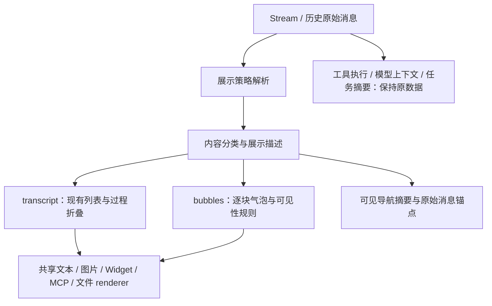

# ChatKit 消息气泡模式：调查与升级计划

日期：2026-10-01。状态：**P0–P4 首期已实现，待用户审核；P5 保持后续范围**。ChatKit 调查基线：`84a95e2`。

## 1. 建议与范围

在现有 `messagePresentation` 下增加 `mode: 'transcript' | 'bubbles'`，默认保留原来的消息列表。气泡模式把每个可见的 AI 文本块、图片和结果组件放进气泡容器，隐藏普通工具调用组；消息数据、执行、历史和操作目标保持原语义。

先通过 ChatKit options 启用，预留统一的配置解析入口。Assistant 配置以后作为默认值来源接入，不先猜测平台字段。多 Assistant 群聊本期不实现，但展示层从一开始就区分消息角色、发言者身份和执行归属。

本计划以用户提供的截图为视觉参考：AI 靠左、中性色气泡；用户靠右、主题强调色气泡；同一回复可以有多个独立气泡。Grok bot / Muse / OpenAI Dots 仅作为用户提出的交互方向，不据此假定这些产品的内部实现。截图里的粉色、角色装饰和已读回执不作为本期必需能力。

本期实施范围是 ChatKit 的 React UI、公共 options 类型、集成示例和测试。Angular 只保留必要的宿主参数传递，不建设另一套消息渲染器。下文保留设计依据；当前用法、实施范围及验收边界见[实现说明](./message-bubble-presentation.md)。

## 2. 现状与代码依据

| 位置                                                                                                                                                                              | 已有行为                                                                                                | 对本次升级的影响                                                          |
| --------------------------------------------------------------------------------------------------------------------------------------------------------------------------------- | ------------------------------------------------------------------------------------------------------- | ------------------------------------------------------------------------- |
| [options.ts](../../packages/chatkit/src/options.ts)                                                                                                                               | `messagePresentation` 目前只有 `collapseProcess`                                                        | 可在已有配置命名空间内扩展，无需新增平行开关                              |
| [MessageList.tsx](../../packages/chatkit-ui/src/components/thread/MessageList.tsx)                                                                                                | 用户消息已有背景气泡；AI 消息无统一气泡；管理原始消息操作、引用、审批落点、历史加载和导航锚点           | 不能只给 AI 外层加背景，否则整条回复仍只有一个大气泡                      |
| [ai.tsx](../../packages/chatkit-ui/src/components/thread/messages/ai.tsx)                                                                                                         | 渲染文本、推理、工具组、Agent 树、Widget、MCP App；另外渲染文件变更与资源卡片                           | 气泡化需要覆盖块级渲染和尾部结果组件两个入口                              |
| [tool-component-group.tsx](../../packages/chatkit-ui/src/components/thread/messages/tool-component-group.tsx)                                                                     | 普通工具归组；部分图片产物在 `DefaultToolCallOutput` 内通过 `ToolOutputAttachments` 展示                | 直接不渲染工具组会连可见图片结果一起隐藏                                  |
| [component-message-renderers.tsx](../../packages/chatkit-ui/src/components/thread/messages/component-message-renderers.tsx)                                                       | 注册组件目前区分 `standalone` / `grouped-step`，有检索、搜索等专用渲染器                                | 需要补充展示语义，不能把所有 `component` 都当作过程丢弃                   |
| [assistant-presentation.ts](../../packages/chatkit-ui/src/lib/assistant-presentation.ts) / [现有过程折叠说明](../assistant-process-presentation.md)                               | `collapseProcess` 保留最终 root answer，把此前过程折叠；同执行链的相邻 AI / tool 记录可能归并           | 气泡模式要求保留各文本块，不能直接复用“只保留最终答案”的投影              |
| [message.ts 类型](../../packages/chatkit/src/message.ts) / [消息合并](../../packages/chatkit-ui/src/lib/message.ts)                                                               | 文本块有可选 `id`、执行归属；增量按块 ID 合并，字符串增量追加到当前文本；`reasoning` 单独保存           | 应以内容块为气泡边界，而非 SSE chunk、句号或换行                          |
| [Stream.tsx](../../packages/chatkit-ui/src/providers/Stream.tsx)                                                                                                                  | 历史按原始消息 ID 合并，排序还考虑父子消息关系                                                          | 气泡拆分不能改变消息数量、分页游标或分支关系                              |
| [message-navigation.ts](../../packages/chatkit-ui/src/lib/message-navigation.ts)                                                                                                  | 导航目前可从工具、推理和 Agent 信息生成摘要                                                             | 气泡模式需使用可见内容摘要，避免导航指向空白或泄露已隐藏的过程文本        |
| [agent-runs.ts](../../packages/chatkit-ui/src/lib/agent-runs.ts) / [agent-run-render-tree.ts](../../packages/chatkit-ui/src/lib/agent-run-render-tree.ts)                         | 已有 sub-agent / external assistant 执行树，含 `xpertId`、名称、头像、父执行等信息                      | 可用于内容归属，但执行树不等于群聊参与者模型                              |
| [chat.tsx](../../packages/chatkit-ui/src/components/chat.tsx)                                                                                                                     | 从 `assistants.get` 获取当前 Assistant 名称、头像；向列表传递单一 `assistantTitle` 和 `collapseProcess` | 新增展示策略和发言者上下文，减少列表对全局名称的依赖                      |
| [WorkbenchPanel.tsx](../../packages/chatkit-ui/src/workbench/WorkbenchPanel.tsx) / [ExternalAssistantView.tsx](../../packages/chatkit-ui/src/workbench/external-assistant/ExternalAssistantView.tsx) | 侧边聊天复制 options；外部 Assistant 列表直接使用 `MessageList`，尚未传展示模式                         | 主聊天、侧边聊天、外部 Assistant 视图需要统一接线；各自的操作权限继续保留 |
| [theme-surfaces.ts](../../packages/chatkit-ui/src/lib/theme-surfaces.ts)                                                                                                          | 已有主题圆角、密度和 surface tokens                                                                     | 气泡使用主题变量，支持 `sharp`，不写死截图圆角或颜色                      |

宿主侧只读核对：`xpert` 基线 `ebc7a28ae` 中，`apps/cloud/src/app/features/chat/clawxpert/clawxpert-conversation-detail.component.ts` 已固定传入 `messagePresentation: { collapseProcess: true }`；`apps/cloud/src/app/features/assistant/assistant-chatkit.runtime.ts` 将其透传给 ChatKit。切换气泡时必须处理这个现存设置。

在所查的 `TXpertOptions` 和 `xpert-sdk-js` 基线 `34b9c97` 的 `packages/core/src/schema.ts` 中，未发现专用的气泡展示配置契约。SDK 的 Assistant 虽有通用 `config` / `metadata`，也不代表其中任意字段已经是受支持的 UI 协议。

## 3. 配置设计与兼容规则

### 3.1 首期公共配置

建议抽出具名类型，继续使用原配置位置：

```ts
// 拟议类型，当前版本尚不支持 mode。
export type ChatKitMessagePresentationOptions = {
  /** 默认 transcript，保留现有列表。 */
  mode?: 'transcript' | 'bubbles';
  /** 仅在 transcript 模式下生效；默认 false。 */
  collapseProcess?: boolean;
};

// 宿主在完整 options 中设置：
const messagePresentation: ChatKitMessagePresentationOptions = {
  mode: 'bubbles',
};
```

| 配置                                            | 行为                                                           |
| ----------------------------------------------- | -------------------------------------------------------------- |
| 未传 `messagePresentation`                      | 完整原列表，行为不变                                           |
| `{ collapseProcess: true }`                     | 原列表的过程折叠，行为不变                                     |
| `{ mode: 'transcript', collapseProcess: true }` | 显式启用原列表的过程折叠                                       |
| `{ mode: 'bubbles' }`                           | 文本块 / 结果气泡；普通过程隐藏                                |
| `{ mode: 'bubbles', collapseProcess: true }`    | 气泡规则优先；保留配置值但不运行过程折叠，切回原模式时重新生效 |

首期不增加 `hideTools`、`hideReasoning` 等相互组合的公共布尔开关。气泡模式采用下面统一的可见性规则，避免出现“工具隐藏了，审批也消失了”一类组合错误。

`setOptions` / 框架 options 更新可以切换展示。切换不重新请求历史，不停止执行，不清空输入草稿；维持当前阅读位置。流式回复、已填写表单、MCP App 会话等状态必须保留。若现有组件树切换会 remount，应先解决稳定容器或状态持有问题，不能以重建整个 Chat 作为切换手段。

### 3.2 Assistant 配置的后续接入

统一解析器接收两个**已归一化且有类型的来源**：宿主 options 与可选 Assistant 展示默认值。按字段应用优先级：

```text
显式 ChatKit options > Assistant 默认值 > SDK/UI 默认值
```

例如宿主显式设置 `mode: 'transcript'` 必须覆盖 Assistant 的气泡偏好；宿主只设置 `collapseProcess` 不应阻止 Assistant 提供 `mode`。`undefined` 表示未指定，不把 `false` 当成未指定。

首期解析器的 Assistant 输入留空即可；不用为展示模式增加服务端调用。平台未来确定契约后，再完成保存、发布、查询、SDK 类型及宿主映射。尚未确定存放在 `options` 还是其他受控配置中，本计划不虚构 `metadata.messagePresentation` 等现存字段。

异步获取默认值时需要处理 Assistant / 组织范围变化和旧请求返回；宿主显式 mode 可以立即呈现，不等待该请求。自动默认值避免在用户已经阅读或流式输出时突然切换；具体装载时机随平台契约补齐。缓存不得跨 Assistant、组织或配置版本串用。

## 4. 气泡模式的内容规则

核心原则是**隐藏过程 UI，保留交付内容和可操作交互**。原始消息、工具结果、模型上下文、任务摘要数据源始终保留。

| 内容                                             | 气泡模式                               | 必须保留的行为                                                                |
| ------------------------------------------------ | -------------------------------------- | ----------------------------------------------------------------------------- |
| AI 字符串 / `text` 块                            | 每个非空语义块一个文本气泡             | Markdown、代码、公式、链接、引用；同块增量更新原气泡                          |
| 用户消息                                         | 右侧主题色气泡                         | 编辑、附件、引用、能力选择标签和排队状态                                      |
| `reasoning`、普通工具调用组、工具参数 / 原始日志 | 默认不显示；不留折叠组标题和占位高度   | 数据保留；原模式仍可查看                                                      |
| 工具输出中的已声明图片附件                       | 提取为图片结果气泡                     | 复用已校验的 artifact 协议、预览授权和错误状态                                |
| 搜索 / 检索结果                                  | 已注册的来源结果按紧凑结果气泡呈现     | 复用现有来源链接、引用定位；不自动把任意工具 JSON 变成聊天正文                |
| 普通图片、附件、资源卡片                         | 媒体 / 文件气泡                        | 预览、下载、打开 Workbench 和资源版本语义                                     |
| `MessageFileActivity`                            | 文件变更结果气泡                       | 审阅、差异、原路径和条目操作；同一回执只呈现一次                              |
| Widget / A2UI、MCP App                           | 富内容气泡，可使用更宽布局             | 表单、回调、iframe 隔离和已输入状态；历史 MCP 结果不得重新调用工具            |
| 待审批、`request_user_input` 及回答确认卡        | 始终显示为交互气泡                     | 原 toolCallId / messageId、提交与取消、等待状态；不落入隐藏工具分类           |
| 正在思考 / 等待工具                              | 一个简短状态气泡，复用真实运行状态     | 没有文本时不表现为“无响应”；有文本时不重复堆叠状态；遵循现有 Pet 开关         |
| 失败、暂停、取消、超时                           | 简短且可访问的状态气泡                 | 基于真实执行状态；保留原重试 / 恢复入口，不自行重复执行；不展示整个普通工具组 |
| 系统 / 事件消息                                  | 保留用户可感知的事件，使用中性紧凑气泡 | 不冒充 Assistant 发言；纯遥测不转成聊天内容                                   |
| Context compression、执行进度、Memory 等内部过程 | 经现有类型明确识别后归入过程           | 需要用户关注的失败 / 中断进入状态气泡；业务型独立组件不按名称误删             |
| 未知自定义组件                                   | 保守保留为兼容组件气泡                 | 沿用受控 fallback 和必要详情，不因类型不认识就静默丢弃                        |

只有工具、没有最终文本的回复：有图片 / 文件 / 交互结果就展示结果；仍在执行时展示状态；已明确成功但没有可见结果时给出简短完成状态。缺少完成信号不能猜测成功；失败或中断不能用空白替代。已恢复的中间工具失败不应把整条成功回复标成失败；未恢复、仍需关注的错误才保留状态提示。

子 Agent 先保留现有执行归属与外部 Assistant 的打开入口，容器改成紧凑结果气泡。展开后的文本继续按块呈现，内部普通工具组遵循隐藏规则。不能把所有子 Agent 文本无标识地铺成主 Assistant 的发言，也不在本期将执行树直接转换为群聊。

### 气泡边界示例

```text
同一原始 assistant message：
  text#1「我先检查一下。」
  tool#2（含一张已声明的结果图片）
  text#3「这里是结果。」
  resource-card#4

气泡列表：
  [我先检查一下。]
  [结果图片]
  [这里是结果。]
  [文件结果卡片]
  消息操作 / 更新时间
```

文本块中的多个 Markdown 段落仍属于同一气泡；不人为按句子、换行、token 切分。隐藏工具后也不把工具两侧原本独立的文本块合并。顺序按现有消息与内容块语义确定，不能为了动画延迟显示已经收到的回复。

## 5. 展示层结构

推荐在现有 renderer 前增加一层轻量、可测试的展示投影，复用现有叶子组件，不复制整份 `MessageList` / `ai.tsx`。



拟议职责：

| 单元                         | 职责                                                                                      |
| ---------------------------- | ----------------------------------------------------------------------------------------- |
| `resolveMessagePresentation` | 默认值、配置优先级、mode 与 collapseProcess 互斥规则                                      |
| `buildMessagePresentation`   | 在原始消息 / 块上生成带来源的展示描述；不执行工具、不发请求、不生成 React 节点            |
| 内容分类适配器               | 区分 `text`、`process`、`result`、`interaction`、`status`；复用有类型的解析器和组件注册表 |
| `MessageBubble`              | 文本 / 媒体 / 交互 / 状态容器的外观、宽度与主题变量                                       |
| `MessageBubbleGroup`         | 同一消息的发言者标识、气泡间距、原消息级操作与时间                                        |
| 共享内容 renderer            | 保留现有 Markdown、图片、工具产物、Widget、MCP、文件功能；适配气泡外观时不重复套卡片边框  |

组件注册表已有的 `standalone` / `grouped-step` 是分组信息，不足以表达“普通过程还是必须保留的交互”。先增加内部语义描述，不急于发布任意宿主函数回调，避免 iframe options 序列化和第三方自定义 API 膨胀。

默认 transcript 路径应尽量保持原有行为，逐步抽出共享叶子。不能同时挂载两份列表后用 CSS 隐藏其中一份：这会重复表单、iframe、计时器和潜在副作用。模式转换也不能依赖卸载重建有状态交互组件。

## 6. 消息身份、流式与操作语义

### 稳定身份

一个逻辑消息可以映射为多个展示块，但仍只有一个原始 messageId。每个展示块保存来源定位：`messageId`、内容集合（如 `content`）、原始块 ID / 块序号，以及可选 executionId。

优先用 `(messageId, content.id)`；历史缺少块 ID 时用消息内的原始位置作为兼容回退，不使用过滤后的气泡索引，不在 render 中生成随机 ID。资源 / 回执使用现有稳定键并与普通内容类型区分，防止重复 key 和重复卡片。没有原始消息 ID 的临时消息需要沿用或建立会话内稳定标识，分页插入不能让已有消息换身份。

位置回退只能保证来源顺序稳定时的连续性。流式期间若历史补全会插入 / 替换无 ID 块，需在投影缓存中协调来源标识，并增加对应测试；不能承诺任意重排后仍能无损匹配。后续服务端块 ID 的补齐可以加强此能力，但不作为首期普通气泡的 API 前置条件。

### 流式与生命周期

- 同一文本块追加字符时更新原气泡，不每个事件新增气泡。空块不占位，内容首次出现再显示。
- 隐藏的工具状态更新无需反复渲染整个历史；按消息修订缓存投影，兼容当前消息合并的更新方式，不能只按对象引用缓存而漏更新。
- 气泡高度变化继续遵守现有跟随底部规则；用户向上阅读时不强拉到底部。分页和模式切换用原消息 / 块锚点与相对偏移恢复位置。
- streaming / paused / failed 从实际运行状态派生，不能从是否存在气泡推断执行结束。前期仍复用当前单 Assistant 的运行模型。
- 图片异步加载、代码展开和 MCP iframe 尺寸变化要验证滚动稳定性；不要先引入全量虚拟列表以免破坏交互实例生命周期。

### 操作与辅助能力

| 功能                 | 规则                                                                                                     |
| -------------------- | -------------------------------------------------------------------------------------------------------- |
| 整条回复复制         | 气泡模式复制这条原始消息的可见文本，按原顺序组合；不带隐藏过程和原始工具 JSON。原模式继续原复制规则      |
| 单块复制 / 引用      | 文本选择引用保留原 messageId；气泡可提供单块复制，代码块继续原复制动作；整条回复复制与单块复制标签要明确 |
| 重试、分支、用户编辑 | 始终调用原消息 / checkpoint，不使用气泡序号；一条原消息只有一组主操作                                    |
| 审批与提问           | 仍按 toolCallId 定位，挂在所属消息的交互区域；找不到锚点时使用现有可见兜底                               |
| 时间                 | 继续使用真实服务端更新时间与现有本地化规则；同一消息的多个气泡不重复堆叠时间，不伪造已读状态             |
| 快速导航             | 从可见投影生成摘要；隐藏过程不独立生成无落点条目。已有隐藏消息链接映射至所属可见回复或明确兼容落点       |
| 引用来源             | 显示当前内容的发言者；来源不确定时用中性标签，不能全部套用全局 assistantTitle                            |
| 任务摘要 / 文件审阅  | 继续读取完整原数据，不因展示过滤而减少产物或操作入口                                                     |

跨多个原消息的相邻同作者气泡可减少重复姓名，但不合并语义消息，不把其中一条消息的分支 / 重试附到另一条消息上。已有过程折叠的跨记录分组只在 transcript 中运行。

## 7. 视觉与可访问性

文本气泡采用内容自适应宽度；桌面建议最大约为消息列的 80%，窄屏可放宽到 92%。复杂表格、文件变更和交互 App 可占满可用消息列；气泡不要求所有组件挤进同一窄宽度。

背景与文字成对使用现有主题 token：用户沿用 primary / primary-foreground；AI 使用中性 surface 及对应 foreground。增加的气泡 token 应从现有主题变量派生，圆角跟随 `--chat-panel-radius` / `--chat-item-radius` 与 radius 预设，密度跟随 density。`sharp` 下必须无强制圆角。

普通短句气泡、带 padding 的文本气泡、边到边媒体气泡和富交互气泡分开处理。复用组件有自身 Card 外框时只保留一层主要边界，不出现“气泡里套卡片再套气泡”。代码与表格在内部横向滚动；不通过整体 `overflow: hidden` 裁掉菜单、公式和交互控件。

单 Assistant 首期可保持名称 / 头像轻量展示：同一连续发言组仅首次显示，用户侧保持现状；多发言者未来出现时标识必须明确。头像使用现有可信头像类型和加载机制，不为气泡另造协议。

键盘 focus 与触屏均可发现操作；气泡不统一加 `role="button"`。流式播报沿用或统一现有列表级机制，避免每个 token / 气泡重复宣布。需要验证浅色、深色、高对比、缩放、长链接和无动画偏好。

## 8. 多 Assistant 扩展预留

本期引入内部“发言者解析”边界，但不向 SDK 消费者发布完整群聊协议。拟议内部结构如下，字段不写入现有持久化消息：

```ts
type MessageActor = {
  id: string; // 稳定的发言者身份，作用域内唯一
  kind: 'user' | 'assistant' | 'system' | 'unknown';
  name?: string;
  avatar?: ChatkitAvatarData; // 复用现有头像类型
};

type PresentationSource = {
  messageId: string;
  blockId?: string;
  sourceIndex?: number;
  executionId?: string; // 执行归属，不是 actor.id
};
```

首期拟由适配器把主 Assistant 的真实 assistantId、名称、头像转换成 actor；当前用户在无显式身份时使用会话内的 self 身份。子 Agent / 外部 Assistant 内容按现有 execution 信息保存来源。`agentKey`、显示名称和 executionId 都不能直接成为跨会话参与者的稳定 ID。

预留以下边界：

- **身份与角色分离**：多个 actor 都可以是 assistant；对齐规则取决于是否当前用户，不根据“第几个 Assistant”交替左右。不同 Assistant 默认都在左侧并展示各自标识。
- **连续分组按 actor**：同为 assistant 不代表同一作者；系统事件、用户发言和执行边界按需要中断视觉分组。不能跨作者合并气泡。
- **动作按源消息归属**：未来重试、分支、模型信息、权限从所属 Assistant / 执行解析，不能复用一个全局 handler 猜测目标。
- **内容实例局部化**：Widget / MCP 状态键包含作用域与原消息来源，避免不同 Assistant 的同名组件碰撞。
- **状态可扩展**：当前单 Assistant 状态先经适配器提供；未来改为按 actor / execution 的状态集合，不把“最后一条 AI 消息就是唯一正在输出的 Assistant”写进气泡组件。

真正群聊还需要明确：参与者目录、服务端消息作者字段、并行流的排序 / 去重、会话与执行路由、@提及、权限及持久化协议。当前 `ChatkitMessage.type`、可选块 `xpertName` 和 Agent 执行树不足以完成这些能力。本期只预留，不伪造多 Assistant 数据或承诺前端开关即可开启群聊。

## 9. 分批实施计划

P0–P4 已按以下职责完成实现与首轮验收，改动等待用户审核；P5 单独推进。下表保留各阶段的交付门槛。

| 阶段                 | 实施内容与主要位置                                                                                   | 交付 / 验收门槛                                                                                         |
| -------------------- | ---------------------------------------------------------------------------------------------------- | ------------------------------------------------------------------------------------------------------- |
| P0：配置与基线       | `options.ts` 提取类型与增加 mode；新增解析器；建立文本 / 工具 / 交互 / 历史 fixtures；记录原模式基线 | 三种实际行为（原始、过程折叠、气泡）规则明确；未配置完全兼容。此时气泡尚不对正式宿主开放                |
| P1：展示投影         | 抽出内容分类、source identity、actor adapter；提取工具产物与结果渲染；处理文件回执去重               | 文本块顺序稳定，普通过程与交互能可靠区分；不改原数据与流协议。P1 依赖 P0                                |
| P2：气泡 UI          | `MessageList` / `ai.tsx` 接入统一描述与 `MessageBubble`；主题、流式、状态、审批、富组件全部接入      | 每块文本独立气泡；无普通工具组；附件、文件、Widget / MCP / 问答可用；切换不重复执行或丢表单。P2 依赖 P1 |
| P3：操作与全部入口   | 操作 / 引用 / 导航投影、滚动锚点；主聊天、最大化 Chat tab、侧边聊天、ExternalAssistantView 接线      | 操作指向原消息，窄面板可用，各视图遵守既有交互限制；主聊天最大化切换仍是同一会话实例。P3 依赖 P2        |
| P4：兼容验收与启用   | JS / React / Vue options 透传回归、宿主显式 opt-in、文档示例和 changeset；本地同版本 UI 联调         | 下表场景通过后发布；默认仍为 transcript，宿主可单独回退。P4 依赖 P3                                     |
| P5：Assistant 默认值 | 平台正式契约确认后补保存 / 发布 / API / SDK 类型 / 映射；接入既有解析器                              | options 优先、范围隔离、异步切换安全。独立于首期，不阻塞气泡上线                                        |

建议提交主题：`feat(chat): add message presentation mode contract`、`refactor(chat): add sourced message presentation units`、`feat(chat): render assistant content as bubbles`、`feat(chat): integrate bubble actions and workbench transcripts`、`test(chat): cover bubble presentation compatibility`。不将平台配置契约、群聊协议与首期 UI 混在同一次提交。

首期核心无需新 Xpert API 或沙箱，也不以发布 `xpert-sdk` 为前置。需要同步使用更新后的 ChatKit types 与实际承载 UI 的 iframe bundle；只更新 options 类型或宿主包、仍加载旧 frameUrl，界面不会出现新模式。本地验收应指向当前 ChatKit UI 开发服务。

JS、React、Vue 封装目前采用通用 options 传递，预计不需另造框架专用属性，但仍应测试序列化、初始设置与运行时更新。ClawXpert 的原 `collapseProcess: true` 可保留，试点时显式增加 `mode: 'bubbles'`；Angular 宿主仅负责该配置。

## 10. 验收与回归矩阵

| 场景                             | 必须满足                                                                            |
| -------------------------------- | ----------------------------------------------------------------------------------- |
| 无配置 / 原配置                  | 默认 UI、工具组、过程折叠及操作行为不变                                             |
| 多文本块与 Markdown              | 一个原文本块一个气泡；文本 → 工具 → 文本仍是两段；代码、表格、公式和链接可操作      |
| 流式追加 / 重连 / 历史回放       | 同 ID 不增重复气泡；无 ID 兼容路径可预测；历史快照不复制已有结果                    |
| 空回复 / tool-only / 失败 / 暂停 | 无悬空大气泡、无假成功；运行可感知，失败和等待用户操作可见                          |
| 工具产物                         | 隐藏工具组后图片、来源结果和受控附件仍可访问；原始 JSON 不自动泄露到气泡            |
| 文件活动与资源卡片               | 只显示一次，审阅、打开、下载、版本引用均与原模式一致                                |
| 审批 / request_user_input        | 工具 UI 隐藏后仍可回答 / 批准 / 拒绝，提交绑定原调用                                |
| Widget / MCP App                 | 模式切换、流式更新、切标签不丢状态；历史结果不重新连接或重跑原工具                  |
| 消息操作                         | 复制内容正确，引用来源正确，分支 / 编辑 / 重试目标不受气泡数量影响                  |
| 导航 / 分页 / 滚动               | 无空白锚点；载入旧消息、图片变化、切模式不打断阅读                                  |
| 多种聊天入口                     | 主聊天、最大化 Chat tab、侧边聊天与外部 Assistant 列表的模式一致；权限不扩大        |
| 主题与布局                       | 亮 / 暗、sharp / round 等圆角、三档密度、约 360px 窄面板、200% 缩放无溢出或操作遮挡 |
| actor 预留                       | 用内部 fixtures 检查同角色不同 actor 不合并、不串来源；不宣称已实现群聊             |

测试优先扩展已有 [MessageList.presentation.test.tsx](../../packages/chatkit-ui/src/components/thread/MessageList.presentation.test.tsx)、[ai.test.tsx](../../packages/chatkit-ui/src/components/thread/messages/ai.test.tsx)、[message-navigation.test.ts](../../packages/chatkit-ui/src/lib/message-navigation.test.ts) 以及工具附件、资源卡片、文件活动、Widget / MCP 测试。新增纯投影测试聚焦身份、可见性和排序，不只断言 CSS 类名。

发布前运行相应 UI 测试、类型检查、框架封装测试与构建，并做真实 UI 浏览器交互验收。对长会话和持续流记录 React 提交次数与滚动表现，确认新增气泡未导致每次 token 全量重建列表。首轮自动测试及 ClawXpert 验收已执行，实际覆盖与环境限制见[实现说明的验收记录](./message-bubble-presentation.md#验收记录2026-10-01)。

## 11. 风险与回退

最高风险依次是：隐藏工具导致交付内容或审批丢失、拆块导致操作身份错误、模式切换重建有状态组件、嵌套 Agent 内容来源混淆。P1–P3 的通过条件必须覆盖这些风险，不能只以截图相似作为完成标准。

首期不做消息存储迁移。回退只需设置 `mode: 'transcript'` 或去掉 mode，沿用原 `collapseProcess` 行为。灰度按宿主 / Assistant 显式 opt-in，默认不变；不在用户设备上加入跨会话的隐式模式记忆。

后续仍需产品确认的内容集中在 Assistant 默认配置的正式契约和真正群聊协议。首期可采用本计划的默认建议直接实施，无需为尚未确定的群聊功能提前重构执行与存储层。
